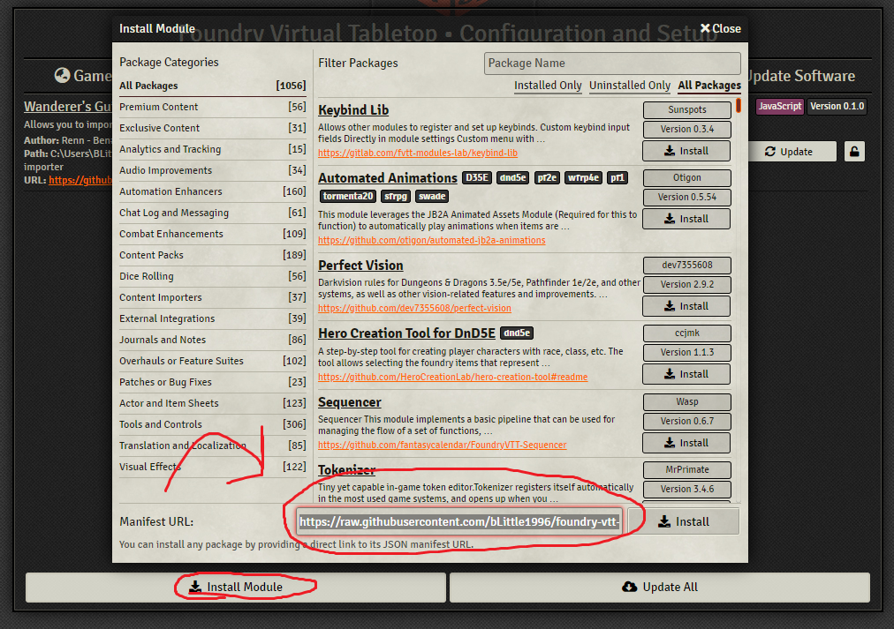
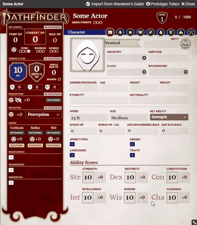

# Foundry VTT: Wanderer's Guide Character Import Module

Created a character on [Wanderer's Guide](https://wanderersguide.app) and want to port it over to Foundry VTT? This module will get the job done. Allegedly.

## Features

This module will import:

- Your character's name
- Ability scores
- Proficiencies (including Lore)
- Ancestry and ancestry features
- Background and background feats
- Class, key ability, and class features
- Feats (supports free archetype module setting)

Not yet supported:

- Importing character senses (like darkvision)
- Import inventory items (including affixed runes)
- Import spell lists and spells

_Note that any ancestries, background, classes, or feats that are not in the Pathfinder 2e system's compendiums will not be imported._

## How to install:

Copy the following link into the manifest URL text input when installing a Foundry module and click "Install".

_Latest module.json path:_
https://raw.githubusercontent.com/bLittle1996/foundry-vtt-wanderers-guide-character-import/main/module.json

## How to use:

On a character sheet you are the owner of (recommended to use a freshly created one, ask your GM to make a new one for you if necessary), select the `Import from Wanderer's Guide` button in the title bar. Then, follow the instructions in the dialog that pops up. That's it. See the gif below for a visual:

Inspired by https://github.com/zarmstrong/foundry-pathbuilder2e-import
